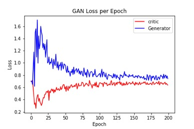
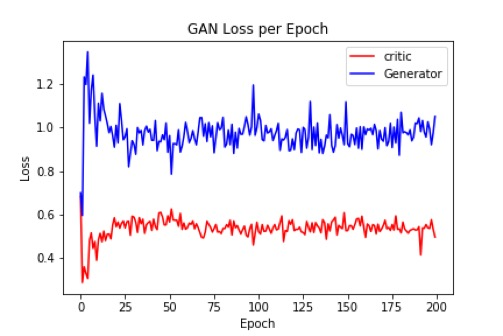
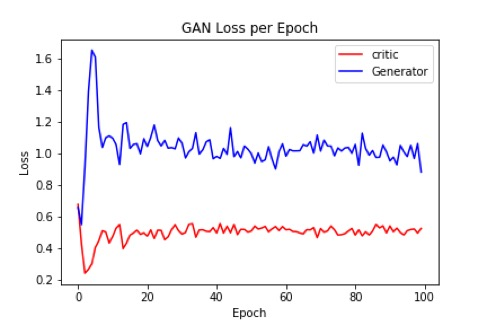
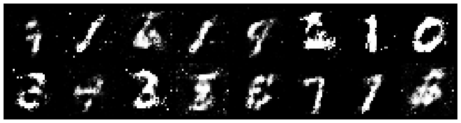
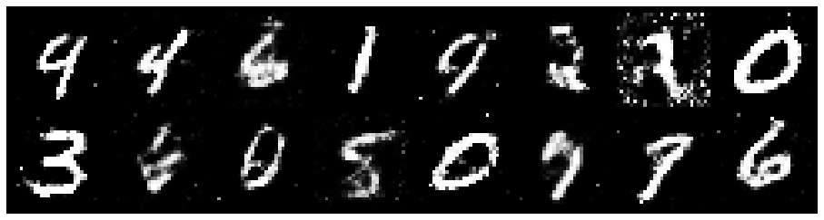
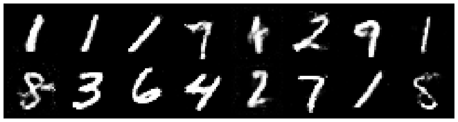

# Studying-the-Robustness-of-GANs-on-Noisy-Data-using-MNIST-and-EMNIST-Datasets

### Suchismita Sahu
Department of Electrical and Computer Engineering 
Viterbi School of Engineering 
University of Southern California 
suchisms@usc.edu

### Supervised By - Dr.Anand A. Joshi
Research Assistant Professor of Electrical and Computer Engineering 
Department of Electrical and Computer Engineering 
Viterbi School of Engineering 
University of Southern California 
ajoshi@usc.edu

## 1. Introduction
Here we study the problem of learning generators from noisy data on MNIST handwritten digit dataset that gives insights about the robustness of Generative Adversarial Networks towards Noisy Data. Perturbed discriminator or noisy adversarial inference with it's feedback is expected to introduce errors in GAN training. The dataset is corrupted for experiments in two scenarios; Corruption by Gaussian noise and corruption by EMNIST dataset. We show experimentally that Generative Adversarial Networks are robust to noise in the data upto a certain threshold and various artifacts are introduced in the output generated images on increasing the noise above the threshold. Here, we resort to visual analysis of the results.

### 1.1. Generative Adversarial Network
Generative Adversarial Networks are a class of generative models that can generate new content. GANs have been really successful in many current applications including generating synthetic datases for research, neural style transfer, image de-noising etc. GANs aim to learn the underlying distribution of the training data. The Generator and Discriminator are trained in such a way that the generator leans to create data such that the discriminator isn't able to distinguish it as fake anymore. The optimization function that a GAN solves is:

Where, D and G are the discriminator and generator respectively optimized over function classes of our choise and N is the distribution of the latent random noise vector. The whole procedure for training GANs requires access to a large number of samples from the desired data distribution. If the networks can approximate the objective functions, they reach a point where they cannot improve anymore. This equillibrium is fleeting rather than being a stable state which makes GANs really hard to train appropriately. The overall success of GANs in generating data relies heavily om the intricate internal interactions between the Generator and Discriminator which introduces instability or a sort of vulnerability.

## 2. Literature Review/ Related Work
The paper "Robustness of conditional GANs to noisy labels"[1] studies the problem of learning conditional generators from noisy labeled data that has labels corrupted by random noise. The paper considers two scenarios i.e. whether the noise model is known or not and proposes novel architectures with a projection discriminator that are experimentally proved to be robust to noisy labeled data. Robustness of GANs against adversarial or random noise has also recently been studied in "AmbientGAN: Generative models from lossy measurements" [3] and "Robust GANs against dishonest adversaries" [4]. The AmbientGAN proposed in [3] addresses corruption on the image data itself rather than on labels. Having given corrupted samples with known corruption, AmbientGAN applies corruption to the output of generator before feeding it to the discriminator. This work is motivated by the similar work in AmbientGAN. [3]

## 3. Architecture Implemented
### 3.1

## 4. Experiments
### 4.1 Data
The dataset used here is the MNIST handwritten digits recognition dataset which has about 60,000 images in training and 10,000 images in test set. The images grayscale having 28*28 dimension each. The dataset can be found at http://yann.lecun.com/exdb/mnist/. [6] The EMNIST dataset can be found at: http://www.itl.nist.gov/iaui/vip/cs_links/EMNIST/gzip.zip. [8] There are 6 classes in the EMNIST dataset out of which the 'bymerge' dataset split is used in this work. 
EMNIST ByMerge: 814,255 characters. 47 unbalanced classes.
The dataset structure of the EMNIST dataset directly matches that of MNIST dataset.

### 4.2 Baseline 
Implemented a basic GAN using Keras and Pytorch frameworks to understand the behavior and baseline output. For both the experiments, the GAN was trained for about 400 Epochs and the Generated images on each Epoch were plotted for visual analysis.

### 4.3 Gaussian Noise
Trained the GAN and observed the outputs obtained using different percentages of Gaussian Noise in the training data. Took varying percentages of the dataset as noisy data without changing the labels. For example, First took 5% of the dataset, convolved original images of the dataset with a Gaussian kernel and added independent Gaussian noise to each pixel of the images. This thus changes the distribution of the original images. The GAN is then trained on this entire dataset and outpts are studied to observe any artifacts introduced.

### 4.4 EMNIST Data
Trained the GAN and observed the outputs obtained using different percentages of Combination of MNIST and EMNIST dataset using the defined function create_dataset. For example one combination would be 60000:10000::MNIST:EMNIST images combination for training.

## 5. Results and Discussion
Standard Generative adversarial networks are somewhat sensitive to noise in the training data. The effect of noise is more prounounced in the early stages of training than in the later stages.
### 5.1 Gaussian Noise
In this work, on training the GAN with added Gaussian noise, rather than distinguishing a real image from a generated image as in a traditional GAN, the discriminator here distinguishes between a real image from a simulated noisy image. This introduces artifacts in the output generated images of the GAN. But the inherent robustness of the GAN to small amount of distorted data doesn't show detectable artifacts in the results as compared to the original GAN results.
Summarizing: 
#### No Effects Seen for 5%, 10% and 20% added Noisy Data
Minute errors are seen on training the GAN for about 400 Epochs with 30% data as Noisy Data.

### 5.2 EMNIST Dataset
In this work, the GAN is trained on a combination of MNIST and EMNIST Images. Starting with a combination of 68000:2000::MNIST:EMNIST images, artifacts like distorted images, extra dots in the image etc. are observed in the Images. The effects are more visible during the early epochs of training and gradually seem to diminish comparatively. The studies show that the addition of EMNIST data while training does affect the performance of the GAN substantially.
Epoch 17

Epoch 60

Epoch 362

Future work on developing new architectures to make the GANs robust to noise have been done in [1] and [4].

## 6. Reproducing Results
To run the ipython notebook, upload the notebook on Google Colab. The code downloads both MNIST and EMNIST datasets from online. Change the Input to the Create_Dataset Function to reproduce the result with varying Noise percentages to the GAN for MNIST-EMNIST combinations.
The Gaussian Noise added GAN can be run using 'GAN_Gaussian.py'
**Dependencies**
Keras, Pytorch, Numpy, Scikit-learn, tensorboardX

## 7. References
1. https://papers.nips.cc/paper/8229-robustness-of-conditional-gans-to-noisy-labels.pdf ; https://github.com/POLane16/Robust-Conditional-GAN
2. https://towardsdatascience.com/understanding-generative-adversarial-networks-gans-cd6e4651a29
3. Ashish Bora, Eric Price, and Alexandros G Dimakis. AmbientGAN: Generative models from lossy measurements. In International Conference on Learning Representations (ICLR), 2018.
4. Zhi Xu, Chengtao Li, and Stefanie Jegelka. Robust GANs against dishonest adversaries. arXiv preprint arXiv:1802.09700, 2018.
5. Generative Adversarial Networks; https://arxiv.org/pdf/1406.2661.pdf
6. Yann LeCun. The mnist database of handwritten digits. http://yann.lecun.com/exdb/mnist/ 1998.
7. Nagarajan Natarajan, Inderjit S Dhillon, Pradeep K Ravikumar, and Ambuj Tewari. Learning with noisy labels. In Advances in neural information processing systems, pages 1196–1204, 2013
8. Cohen, G., Afshar, S., Tapson, J., & van Schaik, A. (2017). EMNIST: an extension of MNIST to handwritten letters. Retrieved from http://arxiv.org/abs/1702.05373
9. https://towardsdatascience.com/understanding-generative-adversarial-networks-gans-cd6e4651a29
