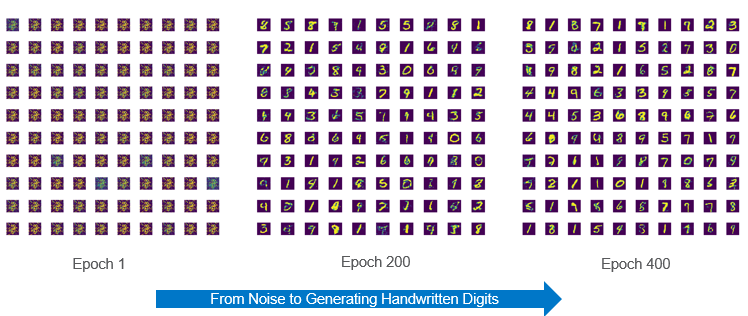

# Studying-the-Robustness-of-GANs-on-Noisy-Data-using-MNIST-and-EMNIST-Datasets

### Suchismita Sahu
Department of Electrical and Computer Engineering 
Viterbi School of Engineering 
University of Southern California 
suchisms@usc.edu

### Supervised By - Dr.Anand A. Joshi
Research Assistant Professor of Electrical and Computer Engineering 
Department of Electrical and Computer Engineering 
Viterbi School of Engineering 
University of Southern California 
ajoshi@usc.edu

## 1. Introduction
Here we study the problem of learning generators from noisy data on MNIST handwritten digit dataset that gives insights about the robustness of Generative Adversarial Networks towards Noisy Data. The dataset is corrupted for experiments in two scenarios; Corruption by Gaussian noise and corruption by EMNIST dataset. We show experimentally that Generative Adversarial Networks are robust to noise in the data upto a certain threshold and various artifacts are introduced in the output generated images on increasing the noise above the threshold.

## 1.1. Generative Adversarial Network
Generative Adversarial Networks are a class of generative models that can generate new content. GANs have been really successful in many current applications including generating synthetic datases for research, neural style transfer, image de-noising etc. GANs aim to learn the underlying distribution of the training data. The Generator and Discriminator are trained in such a way that the generator leans to create data such that the discriminator isn't able to distinguish it as fake anymore. The optimization function that a GAN solves is:

Where, D and G are the discriminator and generator respectively optimized over function classes of our choise and N is the distribution of the latent random noise vector. The whole procedure for training GANs requires access to a large number of samples from the desired data distribution. 

## 2. Literature Review/ Related Work
The paper "Robustness of conditional GANs to noisy labels"[1] studies the problem of learning conditional generators from noisy labeled data that has labels corrupted by random noise. The paper considers two scenarios i.e. whether the noise model is known or not and proposes novel architectures with a projection discriminator that are experimentally proved to be robust to noisy labeled data. Robustness of GANs against adversarial or random noise has also recently been studied in "AmbientGAN: Generative models from lossy measurements" [3] and "Robust GANs against dishonest adversaries" [4]. The AmbientGAN proposed in [3] addresses corruption on the image data itself rather than on labels. Having given corrupted samples with known corruption, AmbientGAN applies corruption to the output of generator before feeding it to the discriminator. This work is motivated by the similar work in AmbientGAN. [3]

## 3. Architecture Implemented

## 4. Experiements
## 4.1. Data
The dataset used here is the MNIST handwritten digits recognition dataset which has about 60,000 images in training and . The dataset can be found at http://yann.lecun.com/exdb/mnist/. [6] The EMNIST dataset can be found at: http://www.itl.nist.gov/iaui/vip/cs_links/EMNIST/gzip.zip. There are 6 classes in the EMNIST dataset out of which the 'bymerge' dataset is used in this work.

## 4.2. Dataset Created for Experiments

## 4.3. Experiement
### 4.3.1 Baseline 
Implemented a basic GAN using Keras and Pytorch frameworks to understand the behavior and baseline output.

### 4.3.2 Gaussian Noise
Trained the GAN and observed the outputs obtained using different percentages of Gaussian Noise.

### 4.3.3 EMNIST Data
Trained the GAN and observed the outputs obtained using different percentages of Combination of MNIST and EMNIST dataset using the defined function create_dataset.

## 5. Results and Discussion
Standard Generative adversarial networks are sensitive to noise in the training data. 

Future work on developing new architectures to make the GANs robust to noise have been done in [1] and [4].

## 6. Reproducing Results
## 6.1. Usage
To run the ipython notebook, upload the notebook on Google Colab. The code downloads both MNIST and EMNIST datasets from online. Change the Input to the Create_Dataset Function to reproduce the result with varying Noise percentages to the GAN.

## 6. References
1. https://papers.nips.cc/paper/8229-robustness-of-conditional-gans-to-noisy-labels.pdf ; https://github.com/POLane16/Robust-Conditional-GAN
2. https://towardsdatascience.com/understanding-generative-adversarial-networks-gans-cd6e4651a29
3. Ashish Bora, Eric Price, and Alexandros G Dimakis. AmbientGAN: Generative models from lossy measurements. In International Conference on Learning Representations (ICLR), 2018.
4. Zhi Xu, Chengtao Li, and Stefanie Jegelka. Robust GANs against dishonest adversaries. arXiv preprint arXiv:1802.09700, 2018.
5. Generative Adversarial Networks; https://arxiv.org/pdf/1406.2661.pdf
6. Yann LeCun. The mnist database of handwritten digits. http://yann.lecun.com/exdb/mnist/ 1998.
7. Nagarajan Natarajan, Inderjit S Dhillon, Pradeep K Ravikumar, and Ambuj Tewari. Learning with noisy labels. In Advances in neural information processing systems, pages 1196–1204, 2013
